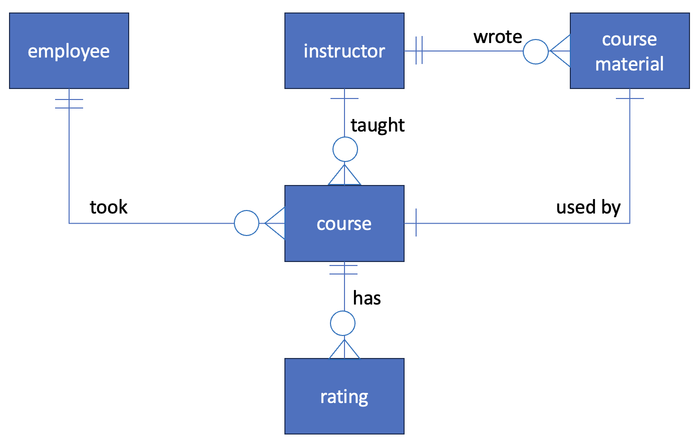

# Design Document

By Ha Manh Bao

Video overview: <URL https://youtu.be/Hacqh8vgcqQ>

## Scope

The db for CS50 SQL includes all entities necessary to facilitate the process of tracking the completion and expiration of each safety course completed by each employee and notifying them of this so they can take refresher courses to ensure their training is always valid and up to date. As such, included in the db's scope is:

* employees, including basic identification info
* instructors, including basic identification info
* courses, including basic info about the course such as id and title
* sesions, including the id for a particular session, the date on which the session took place, the id of the instructor conducting that session and the id of the safety course associated with that session
* classes, including the id for the session conducted and the id of the employees taking that session
* Ratings, including the id of sessions and the rating given by each employee for the session he/she took

Out of scope are the exam grades

## Functional Requirements

This database will support:
* CRUD operations for employees and instructors
* tracking the completion and expiration of safety training courses for all employees
* Allowing the employees to leave a rating for a session(course) they took

## Representation
Entities are captured in SQLite tables with the following schema.
### Entities
The database includes the following entities:
#### employees
The `employees` table include:
* `employee_id`, which specifies the unique ID for the employee as an `INTEGER`. This column has only the `PRIMARY KEY` constraint applied.
* `employee_name`, which specifies the name of the employee as `TEXT`.
* `designation`, which specifies the designation of the employee as `TEXT`.
* `nationality`, which specifies the nationality of the employee as `TEXT`.
* `department`, which specifies the department of the employee as `TEXT`.
* `joining_date`, which specifies the date on which the employee joined the company as `NUMERIC`. The default value for the `joining_date` attribute is the current timestamp, as denoted by `DEFAULT CURRENT_TIMESTAMP`.

All columns in the `instructors` table are required and hence should have the `NOT NULL` constraint applied. No other constraints are necessary.

#### Instructors
The `instructors` table includes:

* `instructor_id`, which specifies the unique ID for the instructor as an `INTEGER`. This column thus has the `PRIMARY KEY` constraint applied.
* `instructor_name`, which specifies the instructor's name as `TEXT`.
All columns in the `instructors` table are required and hence should have the `NOT NULL` constraint applied. No other constraints are necessary.

#### courses
The `courses` table includes:

* `course_id`, which specifies the unique ID for the course as an `INTEGER`. This column thus has the `PRIMARY KEY` constraint applied.
* `course_title`, which specifies the title of the course as `TEXT`.
All columns in the `courses` table are required and hence should have the `NOT NULL` constraint applied. No other constraints are necessary.

#### sessions
The `sessions` table includes:

* `session_id`, which specifies the unique ID for the session as an `INTEGER`. This column thus has the `PRIMARY KEY` constraint applied.
* `session_date`, which specifies the date on which the session was conducted as `DATE`.
* `instructor_id`, which is the ID of the instructor who taught the session as an `INTEGER`. This column thus has the `FOREIGN KEY` constraint applied, referencing the `instructor_id` column in the `instructors` table to ensure data integrity.
* `course_id`, which is the ID of the course associated with the session as an `INTEGER`. This column hence has the `FOREIGN KEY` constraint applied, referencing the `course_id` column in the `courses` table to ensure data integrity.

All columns are required and hence have the `NOT NULL` constraint applied where a `PRIMARY KEY` or `FOREIGN KEY` constraint is not.

#### classes
The `sessions` table includes:

* `session_id`, which is the ID of the session taken by the employee as an `INTEGER`. This column thus has the `FOREIGN KEY` constraint applied, referencing the `session_id` column in the `sessions` table to ensure data integrity.
* `employee_id`, which is the ID of the employee who took the session as an `INTEGER`. This column hence has the `FOREIGN KEY` constraint applied, referencing the `employee_id` column in the `employees` table.

All columns are required and hence have the `NOT NULL` constraint applied where a `PRIMARY KEY` or `FOREIGN KEY` constraint is not.

#### ratings
The `ratings` table includes:

* `rating_id`, which specifies the unique ID for the rating submitted by the employee who took the session as an `INTEGER`. This column thus has the `PRIMARY KEY` constraint applied.
* `session_id`, which is the ID of the session taken by the employee as an `INTEGER`. This column thus has the `FOREIGN KEY` constraint applied, referencing the `session_id` column in the `sessions` table to ensure data integrity.
* `rating`, which specifies the rating for the session provided by the employee who took the session as `INTEGER`.

All columns in the `courses` table are required and hence should have the `NOT NULL` constraint applied. No other constraints are necessary.

### Relationships

The below entity relationship diagram describes the relationships among the entities in the database.

As detailed by the diagram:
* 1 employee can take 1 or all job-specific safety courses in the course list as specified in the safety training matrix.
* 1 instructor can teach 1 or many sessions.
* Each session is associted with or use only 1 course material and is valid for 1 year. After 1 year, the employee is required to take a refresher-session.
* the course training material can be made by 1 or many instructors.
* Each employee when taking the session is required to give 1 rating for that particular session.

## Optimizations

Per the typical queries in `queries.sql`, it is common for users of the database to access all classes taken by employees and track when a particular job-specific course will expire so they can plan ahead to take a refresher course. For that reason, an index is created on the `employee_name` column in the `employees` table and on the `session_id` and `course_id` to speed the identification of completion date and expiry date of the courses by employee nam, course id and session date.

Similarly, as the induction is mandatory course for all employee and this course will expire after 1 year, it's a common practice for the training department to filter all employees with expired safety induction. As such, a VIEW of all induction records with `valid` and `expired` status is created to speed the identification of the employees whose safety induction has expired or will expire soon so that a notification email can be sent to those to remind them of re-taking this refresher course.

## Limitations

The current schema assumes that employees passed all courses. There are no records of whether the passed the exams or not.
